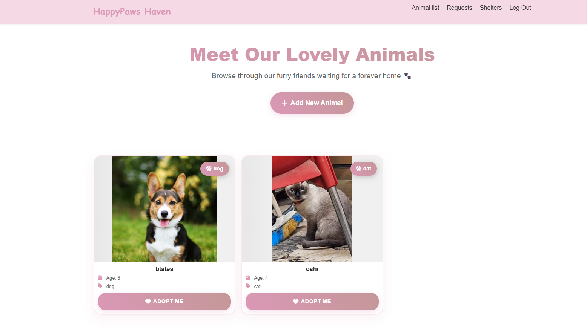

# test (Demo Backend – ASP.NET Core MVC, .NET 9)

This repository is a lightweight demo backend used for testing flows, validating data models, and experimenting with infrastructure. The real production project is yet to come; this codebase serves as a proving ground to iterate quickly before we formalize architecture and UX.

## Screenshots
> Replace these placeholders with real screenshots by placing image files under `docs/images/` and updating the links below.

- Home page
  
  

- Animals index
  
  

- Create animal form
  
  

## About this demo
- **Purpose**: Rapidly test backend endpoints, EF Core models, simple auth redirects, and media uploads.
- **Scope**: Minimal UI with Razor Views just to exercise controllers and data paths.
- **Tech**: ASP.NET Core MVC (.NET 9), EF Core (SQL Server), cookie auth, Cloudinary for image uploads.

## What’s intentionally minimal
- **Auth**: Cookie scheme (`MyCookieAuth`) with a basic login redirect to `/Account/Login`.
- **Validation & Errors**: Kept simple; only what’s needed to test core scenarios.
- **UI/UX**: Functional views, no finalized design system.
- **Domain**: Entities like `Animal`, `MedicalRecord`, `Request`, `Shelter` exist to simulate real flows, not final schemas.

## Not production-ready (by design)
- No comprehensive input validation or threat modeling
- No complete authorization/roles, rate limiting, or auditing
- Secrets appear in sample config; use User Secrets/local env only
- Migrations and schemas may change frequently

## Roadmap to the “real” project
- Replace demo entities with finalized domain models and stricter constraints
- Introduce proper identity/authorization (roles/policies), and end-to-end validation
- Establish API-first shape (versioned REST or gRPC), with typed clients and tests
- Observability (structured logging, tracing), health checks, and robust error handling
- Production build/deploy (Docker, CI/CD), environment-specific configuration

---

## Prerequisites
- .NET SDK 9.0+
- SQL Server (LocalDB/Express or a reachable SQL Server instance)
- Optional: Cloudinary account (for image uploads)

## Quickstart

### 1) Restore
```bash
dotnet --version
dotnet restore
```

### 2) Configure settings (demo)
Create or update `test/appsettings.Development.json` for local development.

The app expects a connection string named `connection` to match the registration in `Program.cs`.

```json
{
  "Logging": {
    "LogLevel": {
      "Default": "Information",
      "Microsoft.AspNetCore": "Warning"
    }
  },
  "ConnectionStrings": {
    "connection": "Server=YOUR_SERVER;Database=depi;Trusted_Connection=True;MultipleActiveResultSets=true;TrustServerCertificate=True"
  },
  "CloudinarySettings": {
    "CloudName": "<your-cloud-name>",
    "ApiKey": "<your-api-key>",
    "ApiSecret": "<your-api-secret>"
  }
}
```

Security tip: use User Secrets locally instead of committing secrets.
```bash
cd test
# Connection string
dotnet user-secrets set "ConnectionStrings:connection" "Server=...;Database=depi;Trusted_Connection=True;MultipleActiveResultSets=true;TrustServerCertificate=True"
# Cloudinary
dotnet user-secrets set "CloudinarySettings:CloudName" "..."
dotnet user-secrets set "CloudinarySettings:ApiKey" "..."
dotnet user-secrets set "CloudinarySettings:ApiSecret" "..."
```

### 3) Database migrations
Migrations are under `test/Migrations/`.
```bash
cd test
# Apply existing migrations
dotnet ef database update
# If EF tools are missing
# dotnet tool install --global dotnet-ef
```

### 4) Run (demo mode)
```bash
dotnet run --project test/test.csproj
# Then open the URL shown in the console (e.g., https://localhost:5xxx)
```

## Project structure (demo)
- `test/Program.cs`: service registration, middleware pipeline, routes
- `test/Data/DepiContext.cs`: EF Core `DbContext` (Animals, MedicalRecords, Products, Requests, Users, VaccinationNeededs)
- `test/Controllers/*`: MVC controllers (`Account`, `Animal`, `Request`, `Shelter`, `Home`)
- `test/Models/*`: data models
- `test/ModelViews/*`: view models
- `test/Views/*`: Razor views
- `test/Services/PhotoServices.cs`: Cloudinary integration
- `test/Helpers/CloudinarySettings.cs`: typed Cloudinary options
- `test/Migrations/*`: EF Core migrations
- `test/wwwroot/*`: static assets

## Features being exercised
- Cookie authentication scheme: `MyCookieAuth` (login path `/Account/Login`)
- Animal CRUD and medical record tracking
- Requests management
- Shelter pages
- Cloudinary-backed photo uploads

## Configuration notes
- Ensure the connection string key is `connection` or update `Program.cs` accordingly:
  - `builder.Services.AddDbContext<DepiContext>(options => options.UseSqlServer(builder.Configuration.GetConnectionString("connection")));`
- Do not store secrets in `appsettings.json` for production. Use environment variables or `appsettings.Production.json` + secure secret storage.

## Useful commands
```bash
# Restore
dotnet restore
# Build
dotnet build
# Run
dotnet run --project test/test.csproj
# Add a migration
cd test && dotnet ef migrations add <Name>
# Update database
dotnet ef database update
```

## Troubleshooting
- SQL connection errors: verify instance name, credentials, and network access. Use `TrustServerCertificate=True` only when appropriate.
- Login redirect: confirm the `/Account/Login` view exists and the cookie scheme is configured.
- Static files not loading: ensure `app.UseStaticFiles()` runs before routing (it does in `Program.cs`).
- Cloudinary issues: validate credentials and network connectivity.

## License
Add a license (e.g., MIT) if desired.
