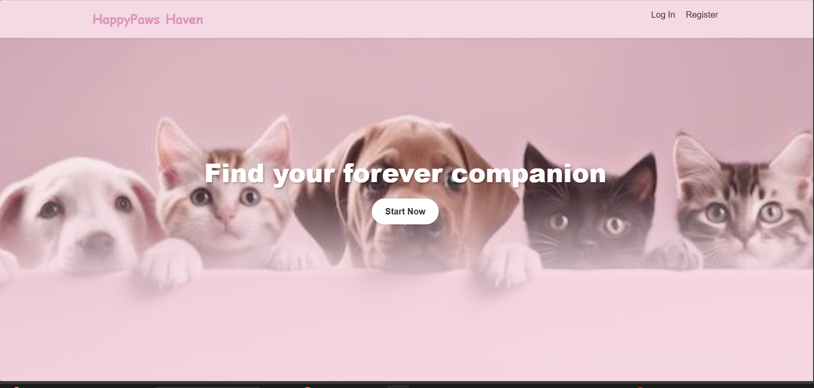

# PetAdopt - Animal Shelter & Adoption Platform

A comprehensive web-based platform that connects animal shelters with potential pet adopters. PetAdopt facilitates the adoption process by providing features for shelter management, animal listings, adoption requests, real-time chat communication, and e-commerce functionality.



## 🎯 Project Overview

PetAdopt is a full-featured ASP.NET Core MVC application that streamlines the pet adoption process. The platform enables shelters to manage their animals, track medical records, and communicate with potential adopters, while providing users with an intuitive interface to browse animals, submit adoption requests, and purchase pet products.

### Key Features

- 🐾 **Animal Management**: Complete CRUD operations for animals with photo uploads
- 🏥 **Medical Records**: Track health records and vaccination schedules
- 💬 **Real-time Chat**: SignalR-powered messaging between users and shelters
- 📋 **Adoption Requests**: Streamlined workflow for adoption request processing
- 🛒 **E-commerce**: Product management and shopping cart functionality
- 💳 **Payment Processing**: Braintree integration for secure transactions
- 👥 **User Roles**: Role-based access control (User, Shelter, Admin)
- 🔐 **Authentication**: ASP.NET Core Identity with Google OAuth support
- 📧 **Email Notifications**: SMTP-based email service for notifications
- 🏢 **Shelter Profiles**: Dedicated pages for shelter information and listings

## 🛠️ Technology Stack

| Layer | Technology |
|-------|------------|
| **Backend Framework** | ASP.NET Core MVC (.NET 9) |
| **Database** | SQL Server |
| **ORM** | Entity Framework Core |
| **Authentication** | ASP.NET Core Identity, Google OAuth |
| **Real-time Communication** | SignalR |
| **Image Storage** | Cloudinary |
| **Email Service** | SMTP (Gmail) |
| **Payment Processing** | Braintree |
| **Frontend** | Razor Views, Bootstrap 5, Font Awesome |

## 📋 Prerequisites

- .NET SDK 9.0 or higher
- SQL Server (LocalDB/Express or a reachable SQL Server instance)
- Cloudinary account (for image uploads)
- Braintree account (for payment processing)
- Google OAuth credentials (optional, for external authentication)

## 🚀 Quick Start

### 1. Clone the Repository

```bash
git clone <repository-url>
cd depi-project-demo
```

### 2. Restore Dependencies

```bash
dotnet restore
```

### 3. Configure Application Settings

Create or update `test/appsettings.Development.json` for local development:

```json
{
  "Logging": {
    "LogLevel": {
      "Default": "Information",
      "Microsoft.AspNetCore": "Warning"
    }
  },
  "ConnectionStrings": {
    "depiContextConnection": "Server=YOUR_SERVER;Database=depi;Trusted_Connection=True;MultipleActiveResultSets=true;TrustServerCertificate=True"
  },
  "CloudinarySettings": {
    "CloudName": "<your-cloud-name>",
    "ApiKey": "<your-api-key>",
    "ApiSecret": "<your-api-secret>"
  },
  "Braintree": {
    "MerchantId": "<your-merchant-id>",
    "PublicKey": "<your-public-key>",
    "PrivateKey": "<your-private-key>"
  },
  "Authentication": {
    "Google": {
      "ClientId": "<your-google-client-id>",
      "ClientSecret": "<your-google-client-secret>"
    }
  },
  "EmailSettings": {
    "SmtpServer": "smtp.gmail.com",
    "SmtpPort": 587,
    "SenderEmail": "<your-email>",
    "SenderPassword": "<your-password>"
  }
}
```

### 4. Use User Secrets (Recommended)

For security, use User Secrets instead of storing sensitive data in configuration files:

```bash
cd test

# Connection string
dotnet user-secrets set "ConnectionStrings:depiContextConnection" "Server=...;Database=depi;Trusted_Connection=True;MultipleActiveResultSets=true;TrustServerCertificate=True"

# Cloudinary
dotnet user-secrets set "CloudinarySettings:CloudName" "..."
dotnet user-secrets set "CloudinarySettings:ApiKey" "..."
dotnet user-secrets set "CloudinarySettings:ApiSecret" "..."

# Braintree
dotnet user-secrets set "Braintree:MerchantId" "..."
dotnet user-secrets set "Braintree:PublicKey" "..."
dotnet user-secrets set "Braintree:PrivateKey" "..."

# Google OAuth
dotnet user-secrets set "Authentication:Google:ClientId" "..."
dotnet user-secrets set "Authentication:Google:ClientSecret" "..."
```

### 5. Database Setup

Apply Entity Framework migrations:

```bash
cd test

# Install EF Core tools (if not already installed)
dotnet tool install --global dotnet-ef

# Apply migrations
dotnet ef database update
```

### 6. Run the Application

```bash
dotnet run --project test/test.csproj
```

The application will start and display the URL (typically `https://localhost:5xxx`). Open it in your browser.

## 📁 Project Structure

```
test/
├── Controllers/          # MVC Controllers
│   ├── AccountController.cs
│   ├── AdminController.cs
│   ├── AnimalController.cs
│   ├── ChatController.cs
│   ├── HomeController.cs
│   ├── MedicalRecordController.cs
│   ├── OrderController.cs
│   ├── PaymentMethodController.cs
│   ├── ProfileController.cs
│   ├── RequestController.cs
│   ├── ShelterController.cs
│   └── TransactionController.cs
├── Data/
│   └── DepiContext.cs    # EF Core DbContext
├── Hubs/
│   └── ChatHub.cs       # SignalR Hub for real-time chat
├── Interfaces/          # Repository interfaces
├── Models/              # Domain models
├── Repository/          # Data access layer
├── Services/           # Business logic services
│   ├── BraintreeService.cs
│   ├── EmailSenderServcies.cs
│   ├── PhotoServices.cs
│   └── RoleServices.cs
├── ViewModels/         # View models for data binding
├── Views/              # Razor views
├── wwwroot/           # Static files (CSS, JS, images)
├── Migrations/        # EF Core migrations
└── Program.cs         # Application entry point
```

## ✨ Features & Modules

### Authentication & Authorization
- User registration and login
- Password reset functionality
- Google OAuth integration
- Role-based access control (User, Shelter, Admin)
- Email confirmation

### Animal Management
- Browse available animals
- Create, edit, and delete animal listings
- Upload animal photos via Cloudinary
- View animal details and medical history
- Track adoption status

### Medical Records
- Create and manage medical records
- Track vaccination schedules
- View medical history for each animal

### Adoption Requests
- Submit adoption requests
- Review and process requests (approve/reject)
- Track request status
- Complete adoption workflow

### Real-time Chat
- SignalR-powered messaging
- One-to-one conversations
- Animal quote messages
- Read receipts and notifications
- Unread message indicators

### E-commerce
- Product management (CRUD operations)
- Shopping cart functionality
- Order processing
- Order history tracking

### Payment Processing
- Braintree integration
- Multiple payment methods
- Secure transaction processing
- Payment method management

### Shelter Management
- Shelter profile pages
- Manage shelter animals and products
- View transaction history
- Contact information display

### Admin Dashboard
- User management
- Animal management across all shelters
- System analytics
- Platform monitoring

## 🔧 Configuration

### Required Configuration Sections

- `ConnectionStrings:depiContextConnection` - Database connection string
- `CloudinarySettings` - Image upload service configuration
- `Braintree` - Payment processing credentials
- `Authentication:Google` - OAuth authentication (optional)
- `EmailSettings` - Email service configuration (optional)

### Connection String Format

```json
{
  "ConnectionStrings": {
    "depiContextConnection": "Server=YOUR_SERVER;Database=depi;Trusted_Connection=True;MultipleActiveResultSets=true;TrustServerCertificate=True"
  }
}
```

## 🗄️ Database

The application uses Entity Framework Core with SQL Server. The database includes the following main entities:

- **Animals** - Pet listings with photos and details
- **MedicalRecords** - Health records for animals
- **VaccinationNeeded** - Vaccination tracking
- **Requests** - Adoption requests
- **ChatMessages** - Real-time chat messages
- **Products** - E-commerce products
- **Orders** - Order management
- **OrderDetails** - Order line items
- **Transactions** - Payment transactions
- **PaymentMethods** - Stored payment methods
- **UserConnections** - SignalR connection tracking
- **ContactMessages** - Contact form submissions

See `docs/PROJECT_DOCUMENTATION.md` for detailed database schema information.

## 📝 Useful Commands

```bash
# Restore dependencies
dotnet restore

# Build the project
dotnet build

# Run the application
dotnet run --project test/test.csproj

# Add a new migration
cd test
dotnet ef migrations add <MigrationName>

# Update database
dotnet ef database update

# Remove last migration
dotnet ef migrations remove
```

## 🐛 Troubleshooting

### SQL Connection Errors
- Verify SQL Server instance name and credentials
- Ensure network access is available
- Use `TrustServerCertificate=True` only in development environments

### Authentication Issues
- Confirm `/Account/Login` view exists
- Verify Identity configuration in `Program.cs`
- Check Google OAuth credentials if using external authentication

### Static Files Not Loading
- Ensure `app.UseStaticFiles()` is called before routing in `Program.cs`
- Verify files exist in `wwwroot` directory

### Cloudinary Upload Issues
- Validate Cloudinary credentials
- Check network connectivity
- Verify file size and format restrictions

### SignalR Connection Problems
- Ensure SignalR hub is properly mapped: `app.MapHub<ChatHub>("/chathub")`
- Check browser console for WebSocket connection errors
- Verify CORS settings if accessing from different domains

## 📚 Documentation

For detailed project documentation, including:
- Database design and ERD
- UI/UX design specifications
- System architecture
- API endpoints
- Payment processing flow

See `docs/PROJECT_DOCUMENTATION.md`

## 🎨 Screenshots

- **Home Page**: `docs/images/home.png`
- **Animals Index**: `docs/images/animals-index.png`
- **Create Animal**: `docs/images/create-animal.png`
- **Database Diagram**: `docs/images/database-diagram.png`

## 👥 User Roles

| Role | Permissions |
|------|-------------|
| **User** | Browse animals, submit adoption requests, chat with shelters, purchase products |
| **Shelter** | Manage animals, process adoption requests, manage products, communicate with users |
| **Admin** | Full system access, user management, platform monitoring |

## 🔒 Security Notes

- Never commit sensitive configuration data to version control
- Use User Secrets for local development
- Use environment variables or secure secret storage for production
- Enable HTTPS in production environments
- Implement proper authorization checks for all endpoints
- Validate all user inputs

## 📄 License

Add a license (e.g., MIT) if desired.

## 🤝 Contributing

Contributions are welcome! Please feel free to submit a Pull Request.

---

**Project Version:** 2.0  
**Last Updated:** January 2025  
**Framework:** ASP.NET Core MVC (.NET 9)
